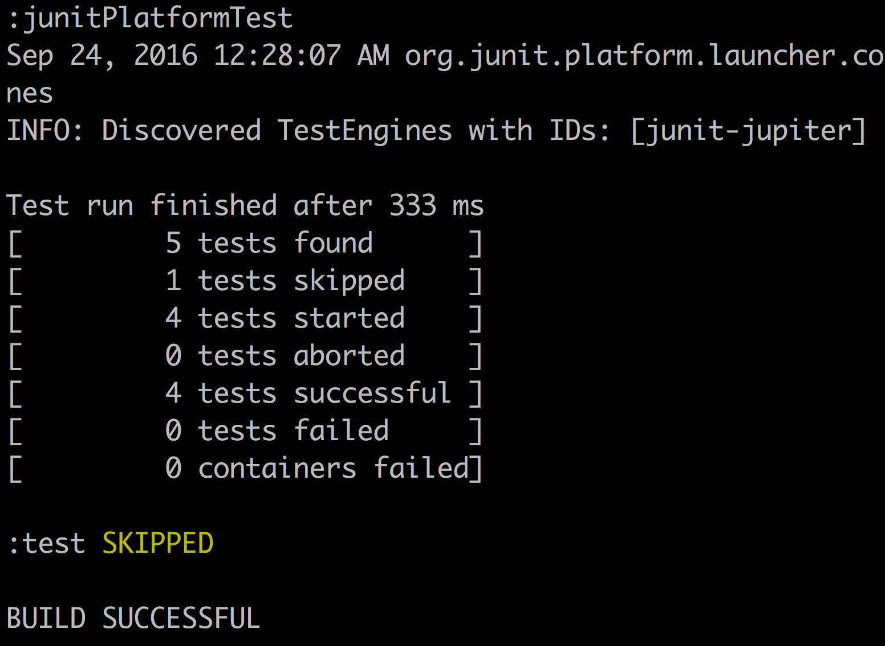
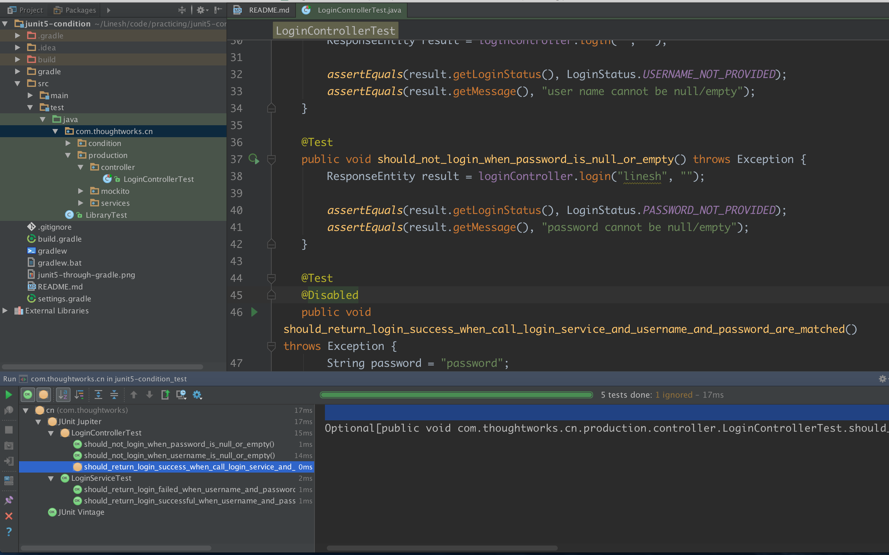

# README(读我)

这是一个试水 JUnit 5的仓库。JUnit 5中引入的一些革新让人后端架构细胞还是挺兴奋的，它最主要的受益者在于各大 IDE 和构建工具厂商，以及 JUnit 团队内部，原因是以前大而全的 JUnit 4限制了工具开发者的定制能力，反过来又使得他们依赖于 JUnit 4的内部 API，进一步又限制了 JUnit 团队自身对于项目的掌控能力，使得他们不敢随便修改哪怕是内部的 API。

基于这个现状，全新的 JUNit 5提出了"[扩展点优于特性](https://github.com/junit-team/junit5/wiki/Core-Principles)
"的设计理念，首先分开了测试 API 和运行 API，并进一步将 JUnit 5分成三个子项目：负责提供测试 API 
的`junit-jupiter-api`、负责运行测试的引擎`junit-jupiter-engine`，以及兼容低版本测试的运行引擎`junit-vintage
`。其次，团队提出对于功能的扩展，提供扩展点要优于直接提供特性。可以看出团队在选择 JUnit 核心功能上的用心与经验。

## 断言 API

对于测试者来说，用于断言的 API 并没有太多变化，这部分也源于 JUnit 在接纳新特性上的小心翼翼。最主要的变化是，支持整组的单元测试、支持 lambda，其次Junit 4的`assertThat()`断言方法不再支持。在断言 API 上使用的也是不同的包，与`vintage`引擎配合使用，将允许团队从 JUnit 4缓慢地迁移到 Junit 5上。

## IDE 和构建工具的支持

截止至本读我撰写时，以下平台及构建工具对 JUnit 的支持情况如下：

* Intellij IDEA 对 JUnit 5 的 M2 和 M3 版都有了支持，[2016.3](https://blog.jetbrains.com/idea/2016/08/intellij-idea-2016-3-eap-is-open/) 及以前的版本可以运行 M2 以前的测试，[2016.3.1 RC](https://blog.jetbrains.com/idea/2016/12/intellij-idea-2016-3-1-rc-updates-junit-5-support-to-m3/) 版本开始则支持 M3
* Eclipse 团队截止本读我撰写时，官方仍未有插件支持。官方表示正在努力
* [gradle](https://github.com/junit-team/junit5-samples/tree/master/junit5-gradle-consumer) 和 [maven](https://github.com/junit-team/junit5-samples/tree/master/junit5-maven-consumer) 都有插件对 JUnit 5 提供了最基本的支持

同时，由于 JUnit 5 采用了基于扩展点而非 runner 的架构方式，部分常用的测试框架使用方式也有变化，比如 mockito。目前而言，mockito 需要通过定制的扩展来运行，JUnit 官方已经给出了一个[扩展](https://github.com/junit-team/junit5-samples/tree/master/junit5-mockito-extension)，本项目也用上了。但在原生支持程度上，mockito 官方表示[JUnit 5支持会随 Mockito 3.0的发布而发布](https://github.com/mockito/mockito/issues/445)
，可能还稍有时日要等待。

## 构建

```
git clone git@github.com:linesh-simplicity/junit5-early-test.git
cd junit5-early-test
./gradlew junitPlatformTest
```





## 参考文章

* [JUnit 5 早期试用体验（一）](http://www.infoq.com/cn/articles/JUnit-5-Early-Test-Drive)
* [JUnit 5 早期试用体验（二）](http://www.infoq.com/cn/articles/JUnit-5-Early-Test-Drive-Part-2)
